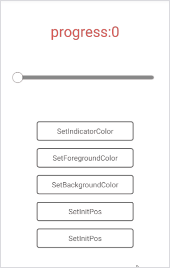

# 

# android-sex-seek [](https://travis-ci.org/dtboy1995/android-sex-seek)
:rocket: the most concise android seekview

# install
- add to your project gradle file

```gradle
repositories {
    maven { url 'https://jitpack.io' }
}
```
- add to your module gradle file

```gradle
implementation 'com.github.dtboy1995:android-sex-seek:0.0.1'
```

# snapshot



# usage
- XML

```xml
<org.ithot.android.view.SeekView
      xmlns:app="http://schemas.android.com/apk/res-auto"
      android:id="@+id/seek_view"
      android:layout_width="300dp"
      android:layout_height="50dp"
      app:indicatorColor="#ffffff"
      app:indicatorRadius="10dp"
      app:indicatorShadowColor="#cccccc"
      app:indicatorShadowEnable="true"
      app:indicatorShadowRadius="3dp"
      app:onStep="onStep"
      app:seekBackgroundColor="#8e8e93"
      app:seekForegroundColor="#8bc34a"
      app:seekHeight="10dp"
      app:seekShadowColor="#ff0000"
      app:seekShadowEnable="true"
      app:seekShadowRadius="3dp" />
```
- Code

```java
SeekView sv = (SeekView)findViewById(R.id.seek_view);
// set progress
sv.init(20);
// set progress range map based
sv.init(20, -20, 30);
// set common callback
sv.setSVCallback(new SVCallback() {
    @Override
    // progress 0 ~ 100
    public void step(int progress) {

    }
});
// set range mapped callback
sv.setSVCallback(new SVRangeMapCallback(-20, 30) {
    @Override
    // progress -20 ~ 30
    public void step(int progress) {

    }
});
```

# attrs

name | type | sample |description
:- | :-: | :-: | :-
indicatorRadius | `dimension`&nbsp;`reference` | 10dp&nbsp;@dimen/ | the circle indicator radius
indicatorColor | `color`&nbsp;`reference` | #FFFFFF&nbsp;@color/ | this circle indicator color
indicatorShadowEnable | `boolean` | true&nbsp;false | enable circle indicator shadow
indicatorShadowRadius | `dimension`&nbsp;`reference` | 2dp&nbsp;@dimen/ | circle indicator shadow radius
indicatorShadowColor | `color`&nbsp;`reference` | #000000&nbsp;@color/ | circle indicator shadow color
seekHeight | `dimension`&nbsp;`reference` | 7dp&nbsp;@dimen/ | seek view height
seekBackgroundColor | `color`&nbsp;`reference` | #CCCCCC&nbsp;@color/ | seek view background color
seekForegroundColor | `color`&nbsp;`reference` | #00FFFF&nbsp;@color/ | seek view foreground color
seekShadowEnable | `boolean` | true&nbsp;false | seek view shadow enabled
seekShadowColor | `color`&nbsp;`reference` | #000000&nbsp;@color/ | seek view shadow color
seekShadowRadius | `dimension`&nbsp;`reference` | 2dp&nbsp;@dimen/ | seek view shadow radius
touchEnable | `boolean` | true&nbsp;false | enable touch control
onStep | `string` | onStep | if not setSVCallback then you can config onStep to work see example
